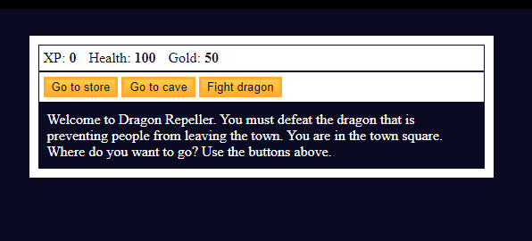

# Mini Project: RPG - Dragon Repeller

## Description

This **JavaScript-based project** is a text-based RPG game where players navigate choices, fight a dragon, and save the town. Players can manage their XP, health, and gold as they progress through different game scenarios. _#freeCodeCamp JavaScript Algorithms and Data Structures Projects_

### Example Gameplay

## Features

-   **Stat Tracking**
    -   Displays and updates player stats (XP, Health, Gold) dynamically.
-   **Interactive Choices**
    -   Explore the store, venture into a cave, or face the dragon.
-   **Monster Battles**
    -   Encounter and fight monsters with real-time health updates.

## Play Online

Click To Play: [Dragon Repeller Game](https://quintincodes.github.io/JavaScript-Mini_Project-Role_Playing_Game/)

## Disclaimer

This project is part of the **JavaScript Algorithms and Data Structures Projects** on freeCodeCamp. The original project tutorial can be found [here](https://www.freecodecamp.org/learn/javascript-algorithms-and-data-structures-v8/).

_Don't forget to star ⭐ this repo if you liked or found it useful!_
